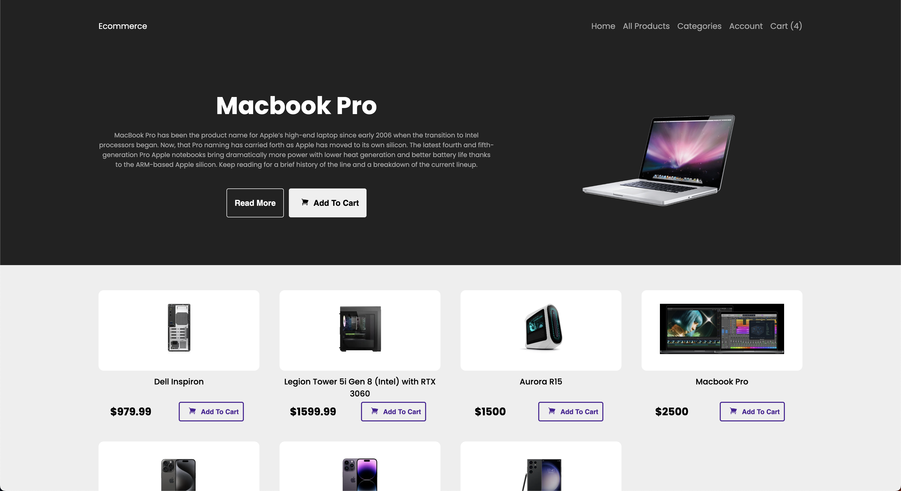

[Next.js](https://nextjs.org/) build.

## Getting Started - local environment
First, run the development server:

```bash/terminal
npm run dev

```


Check out our [Next.js deployment documentation](https://nextjs.org/docs/deployment) for more details.


# TOOLING

<!-- ## User Auth 
using [next-auth](https://next-auth.js.org/)
* [mongdb-adapter](https://authjs.dev/reference/adapter/mongodb) -->

## Atlas MongoDB
 atlas cluster [mongodb-dashboard](https://cloud.mongodb.com/v2#/org/5f9f4921d747f670f33c1aca/projectshttps://cloud.mongodb.com/v2#/org/5f9f4921d747f670f33c1aca/projects)

 ## Mongoose
[mongoose documentation for next.js](https://mongoosejs.com/docs/nextjs.html)
to connect to atlas cluster.

## StyledComponents
[Styled Components](https://www.npmjs.com/package/styled-components) 
used for global style. 

## heroicons
 [heroicons](heroicons.com)

* Image hosting *
## AWS S3
personal console login:
[image hosting S3](https://s3.console.aws.amazon.com/s3)


## s3 skd for posting to instance
[aws-sdk/client-s3](https://docs.aws.amazon.com/AWSJavaScriptSDK/v3/latest/clients/client-s3/)
<!-- 
Open [http://localhost:3000](http://localhost:3000) with your browser to see the result.

You can start editing the page by modifying `pages/index.js`. The page auto-updates as you edit the file.

[API routes](https://nextjs.org/docs/api-routes/introduction) can be accessed on [http://localhost:3000/api/hello](http://localhost:3000/api/hello). This endpoint can be edited in `pages/api/hello.js`.

The `pages/api` directory is mapped to `/api/*`. Files in this directory are treated as [API routes](https://nextjs.org/docs/api-routes/introduction) instead of React pages. 

## Deploy on Vercel

The easiest way to deploy your Next.js app is to use the [Vercel Platform](https://vercel.com/new?utm_medium=default-template&filter=next.js&utm_source=create-next-app&utm_campaign=create-next-app-readme) from the creators of Next.js. 

## Deploy on Vercel

The easiest way to deploy your Next.js app is to use the [Vercel Platform](https://vercel.com/new?utm_medium=default-template&filter=next.js&utm_source=create-next-app&utm_campaign=create-next-app-readme) from the creators of Next.js.

Check out our [Next.js deployment documentation](https://nextjs.org/docs/deployment) for more details.
-->