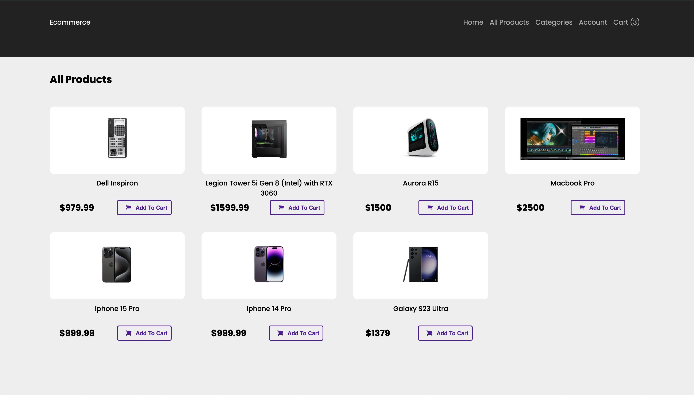
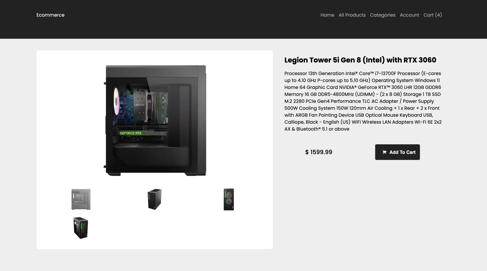

[Next.js](https://nextjs.org/) eCommerce front-end templated build.

# Dashboard


# Products 



# Cart


<br></br>


# TOOLING

 ## Stripe Payments Integration
 [stripe-payment](https://dashboard.stripe.com/) business integration for payment processing. This itegration reroutes to a strip designated url to safely process the paymet .then => redirects back with a response and a payload including meta data defined in the post request.  


## Atlas MongoDB
 atlas cluster [mongodb-dashboard](https://cloud.mongodb.com/v2#/org/5f9f4921d747f670f33c1aca/projectshttps://cloud.mongodb.com/v2#/org/5f9f4921d747f670f33c1aca/projects) used to host the products, user data, catagories (admin), Orders (admin). 

 ## Mongoose
[mongoose documentation for next.js](https://mongoosejs.com/docs/nextjs.html) providing formatting in connecting to the atlas cluster.

## StyledComponents
[Styled Components](https://www.npmjs.com/package/styled-components) 
used for global style. 

## heroicons
 [heroicons](heroicons.com)

# Image hosting 
## AWS S3
personal console login:
[image hosting S3](https://s3.console.aws.amazon.com/s3)


## s3 skd for posting to instance
[aws-sdk/client-s3](https://docs.aws.amazon.com/AWSJavaScriptSDK/v3/latest/clients/client-s3/)

<br></br>

# Dev notes for deployment
Check out our [Next.js deployment documentation](https://nextjs.org/docs/deployment) for more details.


## Getting Started - local environment
fork and open locally, 
run the development server:

```bash/terminal
npm run dev
```

<!-- 
Open [http://localhost:3000](http://localhost:3000) with your browser to see the result.

You can start editing the page by modifying `pages/index.js`. The page auto-updates as you edit the file.

[API routes](https://nextjs.org/docs/api-routes/introduction) can be accessed on [http://localhost:3000/api/hello](http://localhost:3000/api/hello). This endpoint can be edited in `pages/api/hello.js`.

The `pages/api` directory is mapped to `/api/*`. Files in this directory are treated as [API routes](https://nextjs.org/docs/api-routes/introduction) instead of React pages. 

## Deploy on Vercel

The easiest way to deploy your Next.js app is to use the [Vercel Platform](https://vercel.com/new?utm_medium=default-template&filter=next.js&utm_source=create-next-app&utm_campaign=create-next-app-readme) from the creators of Next.js. 

## Deploy on Vercel

The easiest way to deploy your Next.js app is to use the [Vercel Platform](https://vercel.com/new?utm_medium=default-template&filter=next.js&utm_source=create-next-app&utm_campaign=create-next-app-readme) from the creators of Next.js.

Check out our [Next.js deployment documentation](https://nextjs.org/docs/deployment) for more details.
-->